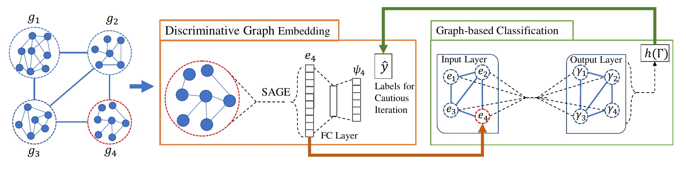

SEAL
============================================
An implementation of "Semi-Supervised Graph Classification: A Hierarchical Graph Perspective" (WWW 2019)
<p align="center">
  
</p>
<p align="justify">
Node classification and graph classification are two graph learning problems that predict the class label of a node and the class label of a graph respectively. A node of a graph usually represents a real-world entity, e.g., a user in a social network, or a protein in a protein-protein interaction network. In this work, we consider a more challenging but practically useful setting, in which a node itself is a graph instance. This leads to a hierarchical graph perspective which arises in many domains such as social network, biological network and document collection. For example, in a social network, a group of people with shared interests forms a user group, whereas a number of user groups are interconnected via interactions or common members. We study the node classification problem in the hierarchical graph where a `node' is a graph instance, e.g., a user group in the above example. As labels are usually limited in real-world data, we design two novel semi-supervised solutions named Semi-supervised graph classification via Cautious/Active Iteration (or SEAL-C/AI in short). SEAL-C/AI adopt an iterative framework that takes turns to build or update two classifiers, one working at the graph instance level and the other at the hierarchical graph level. To simplify the representation of the hierarchical graph, we propose a novel supervised, self-attentive graph embedding method called SAGE, which embeds graph instances of arbitrary size into fixed-length vectors. Through experiments on synthetic data and Tencent QQ group data, we demonstrate that SEAL-C/AI not only outperform competing methods by a significant margin in terms of accuracy/Macro-F1, but also generate meaningful interpretations of the learned representations. </p>

This repository provides a PyTorch implementation of SEAL-CI as described in the paper:

> Semi-Supervised Graph Classification: A Hierarchical Graph Perspective.
> Jia Li, Yu Rong, Hong Cheng, Helen Meng, Wenbing Huang, Junzhou Huang.
> WWW, 2019.
> [[Paper]](https://arxiv.org/pdf/1904.05003.pdf)

### Requirements
The codebase is implemented in Python 3.5.2. package versions used for development are just below.
```
networkx          1.11
tqdm              4.28.1
numpy             1.15.4
pandas            0.23.4
texttable         1.5.0
scipy             1.1.0
argparse          1.1.0
torch             0.4.1
torch-scatter     1.1.2
torch-sparse      0.2.2
torch-cluster     1.2.4
torch-geometric   1.0.3
torchvision       0.2.1
```
### Datasets

#### Graphs
The code takes graphs for training from an input folder where each graph is stored as a JSON. Graphs used for testing are also stored as JSON files. Every node id and node label has to be indexed from 0. Keys of dictionaries are stored strings in order to make JSON serialization possible.

Every JSON file has the following key-value structure:

```javascript
{"edges": [[0, 1],[1, 2],[2, 3],[3, 4]],
 "features": {"0": ["A","B"], "1": ["B","K"], "2": ["C","F","A"], "3": ["A","B"], "4": ["B"]},
 "label": "A"}
```
The **edges** key has an edge list value which descibes the connectivity structure. The **features** key has features for each node which are stored as a dictionary -- within this nested dictionary features are list values, node identifiers are keys. The **label** key has a value which is the class membership.

#### Hierarchical graph

The hierarchical graph is stored as an edge list, where graph identifiers integers are the node identifiers. Finally, node pairs are separated by commas in the comma separated values file. This edge list file has a header.

### Options
Training a SEAL-CI model is handled by the `src/main.py` script which provides the following command line arguments.

#### Input and output options
```
  --graphs                STR    Training graphs folder.      Default is `input/graphs/`.
  --hierarchical-graph    STR    Macro level graph.           Default is `input/synthetic_edges.csv`.
```
#### Model options
```
  --epochs                      INT     Number of epochs.                  Default is 10.
  --weight-decay                FLOAT   Weight decay of Adam.              Defatuls is 10^-6.
  --gamma                       FLOAT   Regularization parameter.          Default is 1.0.
  --learning-rate               FLOAT   Adam learning rate.                Default is 0.01.
```
### Examples
The following commands learn a model and score on the unlabaled instances. Training a model on the default dataset:
```
python src/main.py
```
<p align="center">
  
</p>

Training each SEAL-CI model for a 100 epochs.
```
python src/main.py --epochs 100
```
Changing the budget size.
```
python src/main.py --budget 200
```
